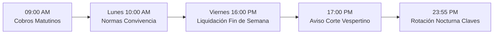

# 📖 MANUAL DE USUARIO INTEGRAL — STREAMVAULT v2
### Guía Operativa, Catálogo de Herramientas, Comandos y Casos de Uso con Ejemplos

Bienvenido al **Manual de Usuario de StreamVault v2**. Este documento constituye la referencia operativa completa para administradores, operadores comerciales y desarrolladores. Contiene la explicación detallada de cada módulo, función, comando y herramienta del servidor FastMCP, acompañada de ejemplos reales de uso.

---

## 📑 TABLA DE CONTENIDOS

1. [Arquitectura General y Modos de Interacción](#1-arquitectura-general-y-modos-de-interacción)
2. [Servidor FastMCP: Herramientas para Agentes de IA](#2-servidor-fastmcp-herramientas-para-agentes-de-ia)
   - 2.1 [Gestión de Cuentas, Pantallas y Stock](#21-gestión-de-cuentas-pantallas-y-stock)
   - 2.2 [CRM de Clientes y Cobro Consolidado](#22-crm-de-clientes-y-cobro-consolidado)
   - 2.3 [Finanzas, Rentabilidad Real y Variación de Costos](#23-finanzas-rentabilidad-real-y-variación-de-costos)
   - 2.4 [Catálogo, Precios y Combos](#24-catálogo-precios-y-combos)
   - 2.5 [Difusión Masiva en Canales (WhatsApp y Telegram)](#25-difusión-masiva-en-canales-whatsapp-y-telegram)
   - 2.6 [Encuestas Interactivas de Demanda y Sondeos](#26-encuestas-interactivas-de-demanda-y-sondeos)
   - 2.7 [Moderación Comunitaria, Grupos y Anti-Estafas](#27-moderación-comunitaria-grupos-y-anti-estafas)
   - 2.8 [Gamificación, Referidos, Cupones y Retención Churn](#28-gamificación-referidos-cupones-y-retención-churn)
   - 2.9 [Criptografía, Secretos Efímeros y Auditoría HMAC](#29-criptografía-secretos-efímeros-y-auditoría-hmac)
3. [Interacción por WhatsApp (Clientes y Operadores)](#3-interacción-por-whatsapp-clientes-y-operadores)
   - 3.1 [Flujo de Auto-Atención y Consulta de Cuentas](#31-flujo-de-auto-atención-y-consulta-de-cuentas)
   - 3.2 [Envío de Comprobantes Bancarios (OCR y pHash)](#32-envío-de-comprobantes-bancarios-ocr-y-phash)
   - 3.3 [Reporte de Cuentas Caídas (#C) y Garantía SLA](#33-reporte-de-cuentas-caídas-c-y-garantía-sla)
   - 3.4 [Funcionalidades Visuales (Reacciones, VCards, Stickers)](#34-funcionalidades-visuales-reacciones-vcards-stickers)
4. [Bot Administrativo de Telegram](#4-bot-administrativo-de-telegram)
   - 4.1 [Alertas Financieras y Aprobación en 1 Toque](#41-alertas-financieras-y-aprobación-en-1-toque)
   - 4.2 [Monitoreo de Cuentas Caídas y Watchdog](#42-monitoreo-de-cuentas-caídas-y-watchdog)
5. [Tareas Programadas Autónomas (APScheduler)](#5-tareas-programadas-autónomas-apscheduler)
   - 5.1 [Auto-Cobro Matutino con Cadencia Humana](#51-auto-cobro-matutino-con-cadencia-humana)
   - 5.2 [Aviso Vespertino de Corte (17:00 hs)](#52-aviso-vespertino-de-corte-1700-hs)
   - 5.3 [Rotación Nocturna de Claves (23:55 hs)](#53-rotación-nocturna-de-claves-2355-hs)
   - 5.4 [Calendario Comunitario: Lunes Normas y Viernes Promos](#54-calendario-comunitario-lunes-normas-y-viernes-promos)
   - 5.5 [Purga Mensual de Comprobantes (+60 días)](#55-purga-mensual-de-comprobantes-60-días)
6. [Módulo HTTP Custom VPN y HWID](#6-módulo-http-custom-vpn-y-hwid)
7. [API REST y Webhooks (FastAPI)](#7-api-rest-y-webhooks-fastapi)
8. [Pipeline DevSecOps y Seguridad Local](#8-pipeline-devsecops-y-seguridad-local)

---

## 1. ARQUITECTURA GENERAL Y MODOS DE INTERACCIÓN

StreamVault v2 puede operarse a través de tres canales principales:
1. **Asistente de Inteligencia Artificial (FastMCP)**: Utilizando lenguaje natural con Claude, Cursor, Antigravity o Gemini Spark. El asistente ejecuta las herramientas del servidor FastMCP de forma autónoma.
2. **Chatbots Oficiales (WhatsApp y Telegram)**: Respuestas interactivas directas para clientes y botones de acción rápida para administradores.
3. **Panel Web & API REST**: Interfaz web segura con cookies HttpOnly y endpoints JSON para integraciones externas.

---

## 2. SERVIDOR FASTMCP: HERRAMIENTAS PARA AGENTES DE IA

El servidor FastMCP expone herramientas seguras para interactuar con la lógica de negocio.

### 2.1 Gestión de Cuentas, Pantallas y Stock

#### `crear_cuenta_con_pantallas`
- **Descripción**: Da de alta una cuenta maestra dividida en casilleros/perfiles independientes con su propio PIN y nombre de perfil.
- **Parámetros**: `platform` (str), `email` (str), `password` (str), `total_screens` (int), `cost` (float, opcional), `expiry_date` (YYYY-MM-DD, opcional).
- **Ejemplo de Uso**:
  ```python
  # Invocación MCP:
  crear_cuenta_con_pantallas(
      platform="Netflix 4K",
      email="nf_premium01@empresa.com",
      password="ClaveUltraSegura2026!",
      total_screens=4,
      cost=4500.0,
      expiry_date="2026-10-21"
  )
  ```
  **Respuesta del Sistema**:
  > ✅ Cuenta maestra de **Netflix 4K** creada con 4 perfiles listos (Perfil 1, Perfil 2, Perfil 3, Perfil 4) con PINs individuales generados y contraseña encriptada en reposo.

#### `vender_perfil_compartido`
- **Descripción**: Busca el siguiente perfil libre de una cuenta maestra de la plataforma solicitada y lo asigna al cliente.
- **Parámetros**: `platform` (str), `client_phone` (str), `client_name` (str), `price` (float), `days` (int, default 30).
- **Ejemplo de Uso**:
  ```python
  vender_perfil_compartido(
      platform="Disney+ Premium",
      client_phone="5491155554444",
      client_name="Carlos Gomez",
      price=3200.0,
      days=30
  )
  ```

#### `consultar_stock_libre`
- **Descripción**: Informa la cantidad de casilleros y cuentas completas disponibles para la venta.
- **Parámetros**: `plataforma` (str, opcional).
- **Ejemplo**: `consultar_stock_libre(plataforma="Max Platino")`
- **Salida**:
  > 📦 **Stock Disponible - Max Platino:**
  > • Perfiles Libres: 7 casilleros disponibles.
  > • Cuentas Completas: 2 cuentas vírgenes.

#### `reemplazar_cuenta_caida`
- **Descripción**: Garantía en 1 clic. Toma una cuenta del stock libre, la asigna al cliente respetando su fecha de vencimiento original y archiva la cuenta dañada para reclamo al proveedor.
- **Parámetros**: `account_id_caida` (int).
- **Ejemplo**: `reemplazar_cuenta_caida(account_id_caida=142)`

---

### 2.2 CRM de Clientes y Cobro Consolidado

#### `consultar_ficha_cliente`
- **Descripción**: Ficha 360° con scoring crediticio, semáforo de morosidad (🟢/🟡/🔴), LTV (Life Time Value) acumulado en ARS y listado de servicios activos.
- **Parámetros**: `telefono_o_query` (str).
- **Ejemplo**: `consultar_ficha_cliente(telefono_o_query="5491133332222")`
- **Salida**:
  ```text
  👤 FICHA 360° DE CLIENTE
  • Nombre: Martín Rodríguez (5491133332222)
  • Tipo: Consumidor Final | Estado: 🟢 Al día
  • LTV Histórico: $38.400 ARS (12 renovaciones exitosas)
  • Servicios Activos:
    1. Netflix 4K (Perfil 2) — Vence: 28/09/2026 ($4.500)
    2. Disney+ Premium — Vence: 05/10/2026 ($3.200)
  ```

#### `generar_cobro_consolidado_whatsapp`
- **Descripción**: Genera el texto oficial unificado de cobro con todos los servicios del cliente sumados, fecha límite y medios de pago oficiales habilitados.
- **Parámetros**: `telefono` (str).
- **Ejemplo**: `generar_cobro_consolidado_whatsapp(telefono="5491133332222")`

---

### 2.3 Finanzas, Rentabilidad Real y Variación de Costos

#### `consultar_rentabilidad_por_plataforma`
- **Descripción**: Calcula la rentabilidad neta real por servicio mediante la fórmula:
  $$\text{Ganancia Neta} = \text{Ingresos Cobrados} - \text{Costo Proveedor} - \text{Costo Caídas}$$
- **Parámetros**: `plataforma` (str, opcional).
- **Ejemplo**: `consultar_rentabilidad_por_plataforma(plataforma="Netflix 4K")`
- **Salida**:
  > 📊 **Rentabilidad Real — Netflix 4K:**
  > • Ingresos: $180.000 ARS | Costo Proveedores: $90.000 ARS
  > • Pérdida por Caídas: $9.000 ARS (Tasa caídas: 4.2%)
  > • **Ganancia Neta:** **$81.000 ARS** (Margen real: **45.0%**)
  > • Diagnóstico: 🌟 Altamente rentable.

#### `verificar_variacion_costos_proveedor`
- **Descripción**: Evalúa si un nuevo precio mayorista excede el umbral del 5% o $200 ARS. Si se supera, proyecta el nuevo precio sugerido al público para mantener el 35% de margen y despacha alerta a Telegram.
- **Parámetros**: `plataforma` (str), `nuevo_costo` (float), `tipo_servicio` (str), `costo_anterior` (float).
- **Ejemplo**:
  ```python
  verificar_variacion_costos_proveedor(
      plataforma="Disney+ Premium",
      nuevo_costo=2800.0,
      tipo_servicio="perfil",
      costo_anterior=2200.0
  )
  ```

---

### 2.4 Catálogo, Precios y Combos

#### `configurar_precio_catalogo`
- **Descripción**: Actualiza el precio mayorista y minorista de una plataforma, recalculando el margen bruto.
- **Parámetros**: `platform` (str), `price_final` (float), `price_reseller` (float), `cost_supplier` (float).
- **Ejemplo**:
  ```python
  configurar_precio_catalogo(
      platform="Max Platino",
      price_final=4200.0,
      price_reseller=3500.0,
      cost_supplier=2100.0
  )
  ```

#### `vender_combo`
- **Descripción**: Descuenta del stock de forma atómica todas las plataformas de un combo (ej: Dúo Netflix + Disney+) y las asocia al cliente.
- **Parámetros**: `combo_id` (int), `client_phone` (str), `client_name` (str).
- **Ejemplo**: `vender_combo(combo_id=2, client_phone="5491144448888", client_name="Lucía Paz")`

---

### 2.5 Difusión Masiva en Canales (WhatsApp y Telegram)

#### `publicar_en_canales`
- **Descripción**: Publica comunicados oficiales con badges temáticos en canales de WhatsApp (`@newsletter`), grupos de anuncios (`@g.us`) y canales de Telegram de forma simultánea.
- **Parámetros**:
  - `titulo`: Encabezado del anuncio.
  - `mensaje`: Cuerpo del comunicado.
  - `categoria`: `promo`, `stock`, `mantenimiento`, o `comunicado`.
  - `plataformas`: Lista de plataformas involucradas.
  - `canal_whatsapp`: JID opcional del canal.
  - `canal_telegram`: ID o username opcional del canal Telegram.
- **Ejemplo**:
  ```python
  publicar_en_canales(
      titulo="Nuevos Cupos Disney+ Premium",
      mensaje="Habilitamos 15 perfiles ultra estables con ESPN y estrenos en vivo.",
      categoria="stock",
      plataformas="Disney+ Premium, Star+"
  )
  ```

---

### 2.6 Encuestas Interactivas de Demanda y Sondeos

#### `lanzar_encuesta_comunidad`
- **Descripción**: Crea y despacha una encuesta nativa en WhatsApp (Evolution API `/message/sendPoll`) y Telegram (`sendPoll`) para medir la intención de compra antes de adquirir stock.
- **Parámetros**:
  - `pregunta`: Texto de la consulta.
  - `opciones`: Opciones separadas por coma (mínimo 2, máximo 10/12).
  - `opciones_multiples`: `True` si permite elegir más de una opción.
- **Ejemplo**:
  ```python
  lanzar_encuesta_comunidad(
      pregunta="¿Qué servicio te gustaría que sumemos con precio promocional?",
      opciones="Apple TV+, Crunchyroll Mega Fan, Tidal HiFi, Servidor VPN USA",
      opciones_multiples=False
  )
  ```

#### `despachar_comunicado_programado`
- **Descripción**: Dispara a demanda uno de los comunicados periódicos del calendario comunitario.
- **Parámetros**: `tipo_comunicado` (`lunes_normas` o `viernes_promo`), `destino_grupo` (opcional).
- **Ejemplo**: `despachar_comunicado_programado(tipo_comunicado="viernes_promo")`

---

### 2.7 Moderación Comunitaria, Grupos y Anti-Estafas

#### `controlar_grupo`
- **Descripción**: Abre (`unmute`) o cierra (`mute`) un grupo de WhatsApp para que solo los administradores puedan hablar.
- **Parámetros**: `group_jid` (str), `action` ("mute" | "unmute").
- **Ejemplo**: `controlar_grupo(group_jid="1203630123456789@g.us", action="mute")`

#### `banear_silencioso` (Silent Ban)
- **Descripción**: Pone a un usuario o grupo en lista negra silenciosa. El bot ignora todos sus mensajes sin responder ni emitir alertas.
- **Parámetros**: `target_jid` (str), `reason` (str).
- **Ejemplo**: `banear_silencioso(target_jid="5491199998888@s.whatsapp.net", reason="Spam reiterado")`

---

### 2.8 Gamificación, Referidos, Cupones y Retención Churn

#### `crear_cupon_descuento`
- **Descripción**: Emite un cupón promocional con fecha límite y límite de usos.
- **Parámetros**: `codigo` (str), `descuento_porcentaje` (float), `valido_hasta` (YYYY-MM-DD), `usos_maximos` (int).
- **Ejemplo**:
  ```python
  crear_cupon_descuento(
      codigo="FINDE20",
      descuento_porcentaje=20.0,
      valido_hasta="2026-09-30",
      usos_maximos=50
  )
  ```

#### `consultar_metricas_churn`
- **Descripción**: Analiza la base de clientes y calcula la probabilidad de abandono según días sin renovar y cantidad de caídas reportadas.
- **Ejemplo**: `consultar_metricas_churn()`

---

### 2.9 Criptografía, Secretos Efímeros y Auditoría HMAC

#### `crear_enlace_secreto_efimero`
- **Descripción**: Encripta un texto sensible (credenciales, pines) y genera una URL de un solo uso que se quema automáticamente al ser consultada por el cliente.
- **Parámetros**: `secreto` (str), `ttl_minutos` (int, default 1440), `actor` (str).
- **Ejemplo**:
  ```python
  crear_enlace_secreto_efimero(
      secreto="Correo: master@vip.com | Clave: Ax99#zZ12",
      ttl_minutos=60,
      actor="soporte_operador"
  )
  ```
  **Salida**: `https://streamvault.local/secret/view/b4c9e8210fa842...`

#### `verificar_integridad_auditoria`
- **Descripción**: Recorre la bitácora criptográfica HMAC-SHA256 y verifica que ningún registro histórico haya sido modificado o alterado directamente en la base de datos.
- **Ejemplo**: `verificar_integridad_auditoria()`
- **Salida**: `✅ Bitácora íntegra: 1,420 bloques auditados con éxito. 0 alteraciones.`

---

## 3. INTERACCIÓN POR WHATSAPP (CLIENTES Y OPERADORES)

### 3.1 Flujo de Auto-Atención y Consulta de Cuentas
Los clientes pueden interactuar de forma privada con el bot para consultar su estado:
* El cliente escribe: `Hola`, `Mis cuentas` o `Estado`.
* **Respuesta del Bot**:
  ```text
  👋 ¡Hola Juan! Estos son tus servicios activos en StreamVault:
  
  📺 1. Netflix 4K (Casa Extra)
     • Vencimiento: 28/09/2026 (En 7 días)
     • Perfil: Perfil 3 (PIN: 8841)
  
  🌐 2. HTTP Custom VPN
     • Vencimiento: 02/10/2026
     • Estado: Activo
  
  Para renovar, envía tu comprobante por aquí. ¡Gracias por confiar en nosotros!
  ```

### 3.2 Envío de Comprobantes Bancarios (OCR y pHash)
* El cliente transfiere y envía una foto o captura de pantalla de Mercado Pago, CBU o Brubank.
* **Procesamiento en Segundo Plano**:
  1. El bot aplica el algoritmo **pHash** sobre la imagen para corroborar que no haya sido enviada antes por otro usuario.
  2. Extrae fecha, importe y número de operación.
  3. Despacha una alerta inmediata con la imagen adjunta a los administradores en Telegram.

### 3.3 Reporte de Cuentas Caídas (#C) y Garantía SLA
* Si una cuenta deja de funcionar, el cliente escribe: `#C Netflix clave incorrecta`.
* **Acción Automática**:
  - Se abre un ticket de reporte en la base de datos.
  - Se activa el **Watchdog SLA** (que alertará al admin si pasan 30 minutos sin reposición).
  - El cliente recibe: `🛠️ Hemos recibido tu reporte (#C). Tu garantía está activa; el equipo está validando tu cuenta.`

### 3.4 Funcionalidades Visuales (Reacciones, VCards, Stickers)
* **Reacciones**: El bot reacciona con `⏳` al recibir el comprobante y con `✅` al aprobar el pago.
* **Contacto VCard**: El bot envía la tarjeta oficial del administrador para compras mayoristas.
* **Stickers**: Al renovar, el bot envía un sticker de bienvenida y agradecimiento oficial.

---

## 4. BOT ADMINISTRATIVO DE TELEGRAM

El bot de Telegram actúa como la **consola de control ejecutivo en el bolsillo del administrador**:

### 4.1 Alertas Financieras y Aprobación en 1 Toque
Cuando un cliente transfiere, el administrador recibe un mensaje enriquecido en Telegram:
```text
📥 NUEVO COMPROBANTE DE PAGO RECIBIDO
• Cliente: Roberto Pérez (5491155551234)
• Servicio: Netflix 4K
• Monto informado: $4.500 ARS
[Imagen del Comprobante Adjunta]
```
Debajo incluye botones inline de acción directa:
* `[ ✅ Aprobar (+30 días) ]`
* `[ ❌ Rechazar ]`
* `[ 👤 Ver Perfil 360° ]`

Al presionar **Aprobar**, en menos de 1 segundo:
1. Se extiende la suscripción 30 días en la base de datos.
2. Se asienta el ingreso en el libro diario contable.
3. Se le envía un WhatsApp al cliente confirmando la renovación con mensaje formal.

### 4.2 Monitoreo de Cuentas Caídas y Watchdog
Si hay cuentas caídas pendientes de reposición por más de 30 minutos, el bot de Telegram emite una alarma sonora y mensaje de atención prioritaria.

---

## 5. TAREAS PROGRAMADAS AUTÓNOMAS (APSCHEDULER)

El planificador de tareas se ejecuta las 24 horas del día sin necesidad de intervención manual:



### 5.1 Auto-Cobro Matutino con Cadencia Humana (09:00 AM)
* Revisa las cuentas que vencen en las próximas 24 a 48 horas.
* Envía recordatorio por WhatsApp respetando pausas humanas aleatorias de **15 a 30 segundos** entre cliente y cliente para evitar detección de spam.

### 5.2 Aviso Vespertino de Corte (17:00 hs)
* Revisa únicamente las cuentas que **vencen hoy** y que aún no han registrado comprobante.
* Informa al cliente que a partir de las 20:00 hs el acceso será suspendido si no envía comprobante.

### 5.3 Rotación Nocturna de Claves (23:55 hs)
* Las cuentas impagas del día cambian su estado automáticamente a `por_cambiar_clave`.
* Se genera la lista de contraseñas a cambiar para el día siguiente.

### 5.4 Calendario Comunitario: Lunes Normas y Viernes Promos
* **Lunes 10:00 AM**: Publica automáticamente en todos los grupos las normas de privacidad (no enviar claves ni comprobantes en grupos) y los medios de pago oficiales.
* **Viernes 16:00 PM**: Publica la liquidación de casilleros libres para maratones de fin de semana e invita a consultar por chat privado.

### 5.5 Purga Mensual de Comprobantes (+60 días)
* El día 1 de cada mes a las 03:00 AM, elimina del almacenamiento las cadenas Base64 de comprobantes ya resueltos para liberar espacio en disco, manteniendo intactos los registros contables.

---

## 6. MÓDULO HTTP CUSTOM VPN Y HWID

StreamVault v2 incluye control nativo para la comercialización de internet ilimitado y túneles VPN:
1. **Asociación de HWID**: Cada cuenta se asocia a la firma única de hardware del dispositivo móvil del cliente.
2. **Prevención de Clonación**: Si otro usuario intenta usar el mismo archivo de configuración en un teléfono distinto, el sistema lo bloquea.
3. **Comando de Auto-Configuración**:
   - `generar_http_custom(servidor="ARG-01", hwid="A1B2C3D4E5F6", dias=30)`

---

## 7. API REST Y WEBHOOKS (FASTAPI)

Para automatizaciones e integraciones desde otros sistemas, StreamVault v2 expone una API REST modular:

| Método | Endpoint | Descripción |
| :--- | :--- | :--- |
| `POST` | `/api/community/polls/send` | Despacha una encuesta interactiva a WhatsApp y Telegram. |
| `POST` | `/api/community/broadcasts/trigger` | Dispara a demanda los comunicados periódicos. |
| `POST` | `/api/community/moderation/check` | Analiza un texto y devuelve el nivel de amenaza (scam/phishing/links). |
| `GET` | `/api/finance/profitability-by-platform` | Devuelve el informe contable de margen neto real. |
| `POST` | `/api/suppliers/check-cost-variance` | Ejecuta la auditoría de costos de proveedores. |
| `POST` | `/webhook/evolution` | Receptor de eventos de mensajes entrantes de WhatsApp. |

#### Ejemplo de llamada con `curl` (Encuesta de Demanda):
```bash
curl -X POST "http://localhost:8000/api/community/polls/send" \
  -H "Authorization: Bearer <TOKEN_ADMIN>" \
  -H "Content-Type: application/json" \
  -d '{
    "question": "¿Qué plataforma deberíamos sumar al catálogo?",
    "options": ["Crunchyroll Mega Fan", "Apple TV+", "Spotify Familiar"],
    "send_whatsapp": true,
    "send_telegram": true,
    "selectable_count": 1
  }'
```

---

## 8. PIPELINE DEVSECOPS Y SEGURIDAD LOCAL

Para verificar la seguridad del sistema en local antes de cada despliegue, ejecuta el runner autónomo:

```bash
# Desde la raíz del proyecto:
npm run security:audit
```

El pipeline ejecuta automáticamente:
1. **SAST**: Análisis estático de código Python y JavaScript.
2. **Secret Scanning**: Búsqueda de tokens, claves privadas y credenciales expuestas en archivos.
3. **SCA**: Análisis de dependencias de `v2/requirements.txt` contra la base de datos de vulnerabilidades OSV.dev.
4. **DAST**: Pruebas dinámicas contra los endpoints locales para verificar rate limiting y rechazo de payloads maliciosos.

**Calificación esperada**: `100/100 (A+) — 0 Hallazgos Críticos/Altos/Medios/Bajos`.

---

*StreamVault v2 — Manual de Usuario Oficial. Diseñado para maximizar la rentabilidad, proteger la privacidad y automatizar completamente el negocio.*
