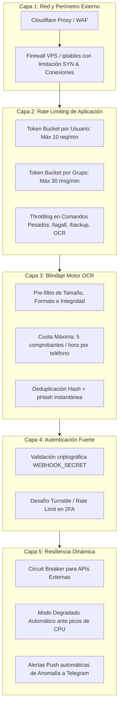

# 🛡️ ROADMAP TÉCNICO, AUDITORÍA DE SEGURIDAD Y ARQUITECTURA ANTI-DDOS
## StreamVault v2 / MCP Vencimientos

Este documento reúne el análisis de seguridad exhaustivo, el plan de mitigación técnica, la arquitectura de protección perimetral Anti-DDoS en 5 capas y el roadmap estratégico de mejoras futuras para el ecosistema **StreamVault v2**.

---

## 🧭 ÍNDICE GENERAL

1. [Auditoría de Vulnerabilidades y Plan de Mitigación Inmediato](#1-auditoría-de-vulnerabilidades-y-plan-de-mitigación-inmediato)
   - [1.1. Autenticación y Control de Acceso Estricto](#11-autenticación-y-control-de-acceso-estricto)
   - [1.2. Aislamiento de Entornos: Prohibición de Comandos Admin en Grupos](#12-aislamiento-de-entornos-prohibición-de-comandos-admin-en-grupos)
   - [1.3. Cifrado Asimétrico / Simétrico de Backups de Base de Datos](#13-cifrado-asimétrico--simétrico-de-backups-de-base-de-datos)
   - [1.4. Detección Perceptual de Comprobantes (pHash) y Privacidad OCR](#14-detección-perceptual-de-comprobantes-phash-y-privacidad-ocr)
   - [1.5. Cifrado en Reposo de Base de Datos SQLite (SQLCipher / AES-256)](#15-cifrado-en-reposo-de-base-de-datos-sqlite-sqlcipher--aes-256)
   - [1.6. Log de Auditoría Inmutable (Append-Only) para Claves Maestras](#16-log-de-auditoría-inmutable-append-only-para-claves-maestras)
   - [1.7. Links Efímeros de Visualización de Credenciales (Anti-SIM Swap)](#17-links-efímeros-de-visualización-de-credenciales-anti-sim-swap)
2. [Arquitectura de Protección Anti-DDoS en 5 Capas](#2-arquitectura-de-protección-anti-ddos-en-5-capas)
   - [Capa 1: Perímetro de Red y Tráfico Web (Cloudflare + Firewall VPS)](#capa-1-perímetro-de-red-y-tráfico-web-cloudflare--firewall-vps)
   - [Capa 2: Rate Limiting de Aplicación Multi-Nivel](#capa-2-rate-limiting-de-aplicación-multi-nivel)
   - [Capa 3: Blindaje del Motor de Visión Artificial (Gemini + Tesseract)](#capa-3-blindaje-del-motor-de-visión-artificial-gemini--tesseract)
   - [Capa 4: Autenticación Fuerte de Webhooks y Endpoints Sensibles](#capa-4-autenticación-fuerte-de-webhooks-y-endpoints-sensibles)
   - [Capa 5: Monitoreo Activo, Circuit Breakers y Modo Degradado Automático](#capa-5-monitoreo-activo-circuit-breakers-y-modo-degradado-automático)
3. [Roadmap de Mejoras y Nuevas Funcionalidades](#3-roadmap-de-mejoras-y-nuevas-funcionalidades)
   - [3.1. Fidelización, Marketing y Crecimiento Comercial](#31-fidelización-marketing-y-crecimiento-comercial)
   - [3.2. Grupos de WhatsApp y Gamificación de Comunidad](#32-grupos-de-whatsapp-y-gamificación-de-comunidad)
   - [3.3. Canales de Difusión Unidireccionales (WhatsApp & Telegram Channels)](#33-canales-de-difusión-unidireccionales-whatsapp--telegram-channels)
   - [3.4. Chats Privados 1:1 con IA Asistente y Retención de Clientes](#34-chats-privados-11-con-ia-asistente-y-retención-de-clientes)
   - [3.5. Auditoría y Consola Administrativa Avanzada](#35-auditoría-y-consola-administrativa-avanzada)

---

## 1. AUDITORÍA DE VULNERABILIDADES Y PLAN DE MITIGACIÓN INMEDIATO

### 1.1. Autenticación y Control de Acceso Estricto
* **Diagnóstico**: Si bien existe verificación de identidad telefónica en `webhooks_api.py` mediante coincidencia de número telefónico limpio, la validación debe estar desacoplada y formalizada como un middleware o decorador centralizado (`@require_admin_role`).
* **Mitigación Planificada**:
  1. Definir una lista blanca estructurada de números de administradores con roles jerárquicos: `SUPER_ADMIN`, `SOPORTE`, `FINANZAS`.
  2. Cada comando sensible (`/pagoapro`, `/pagodene`, `/revertir_pago`, `/baja`, `/caida`) valida el permiso granular del remitente antes de parsear parámetros.
  3. En Telegram, restringir no solo por `chat_id`, sino exigir que el `user_id` del remitente individual dentro del chat coincida con administradores autorizados.

### 1.2. Aislamiento de Entornos: Prohibición de Comandos Admin en Grupos
* **Diagnóstico**: Un comando administrativo jamás debe ser procesado si proviene de un JID grupal (`@g.us`). Si un administrador por error o broma tipea `/pagoapro_12` o `/baja_5` en un grupo público con clientes, el sistema no debe ejecutar la orden en ese contexto.
* **Mitigación Planificada**:
  1. Si `is_group == True` y el texto coincide con expresiones de comandos de administración (`/pagoapro`, `/baja`, `/revertir_pago`, `/deshacer_cambio`, `/caida`), la petición es rechazada de inmediato:
     ```python
     if is_group and is_admin_command(text_lower):
         logger.warning(f"Comando administrativo bloqueado en grupo {group_jid} por seguridad.")
         return JSONResponse({"status": "ignored", "reason": "admin_command_in_group_forbidden"})
     ```
  2. Implementación de una suite de pruebas unitarias automatizadas (`test_group_privacy_isolation.py`) que corra en el pipeline de CI/CD de GitHub Actions asegurando que ningún comando administrativo ni fuga de credenciales responda en contexto grupal.

### 1.3. Cifrado Asimétrico / Simétrico de Backups de Base de Datos
* **Diagnóstico**: Actualmente `/backup` genera `streamvault.db.gz` y lo envía en claro al chat de Telegram. Si el canal de Telegram o el bot token se ve comprometido, se filtra la base de datos íntegra.
* **Mitigación Planificada**:
  1. Integrar cifrado simétrico mediante **AES-256-GCM** (o `cryptography.fernet` con derivación PBKDF2).
  2. La clave de cifrado maestro del backup se almacena en la variable de entorno `BACKUP_ENCRYPTION_KEY` del servidor y **nunca** viaja por el chat.
  3. El archivo exportado pasa a ser `streamvault_backup_<fecha>.db.enc`. Para restaurarlo se requerirá la contraseña maestra del dueño, neutralizando la fuga ante intercepciones en Telegram.

### 1.4. Detección Perceptual de Comprobantes (pHash) y Privacidad OCR
* **Diagnóstico**: La detección por hash criptográfico SHA-256 del archivo binario es vulnerable a manipulaciones de 1 píxel, compresión JPEG o re-capturas de pantalla. Además, enviar comprobantes bancarios directos a Gemini Vision requiere resguardo de privacidad.
* **Mitigación Planificada**:
  1. **Hash Perceptual (ImageHash / dHash / pHash)**:
     - Al recibir una imagen, se computa su `phash` de 64 bits.
     - Si la distancia de Hamming entre la imagen entrante y cualquier comprobante aprobado en los últimos 45 días es $\le 4$, se marca inmediatamente como **"Comprobante Alterado / Reciclado por Edición de Imagen"** y se rechaza.
  2. **Anonimización Pre-OCR**:
     - Filtro local para ofuscar o no almacenar números de DNI ajenos o cuentas destino si no son las oficiales del negocio.
     - Opción de procesar primero con Tesseract local offline y recurrir a Gemini Vision únicamente cuando el índice de confianza sea bajo.

### 1.5. Cifrado en Reposo de Base de Datos SQLite (SQLCipher / AES-256)
* **Diagnóstico**: El archivo `streamvault.db` guarda contraseñas y teléfonos en texto plano en el disco del host.
* **Mitigación Planificada**:
  1. Transición a **SQLCipher** (extensión transparente de cifrado AES-256 de base completa) o cifrado a nivel de columna para campos críticos (`streaming_accounts.password`, `streaming_accounts.profile_pin`).
  2. Implementación de `core/security.py` con `encrypt_secret()` y `decrypt_secret()` usando la clave `DB_SECRET_SALT`. Si un atacante copia el archivo `.db`, no podrá leer contraseñas ni PINs.

### 1.6. Log de Auditoría Inmutable (Append-Only) para Claves Maestras
* **Diagnóstico**: Si un operador o administrador rota una contraseña o modifica un precio, debe existir una bitácora inmutable con sello de tiempo y responsable.
* **Mitigación Planificada**:
  1. Creación de la tabla `audit_log`:
     ```sql
     CREATE TABLE IF NOT EXISTS audit_log (
         id INTEGER PRIMARY KEY AUTOINCREMENT,
         timestamp DATETIME DEFAULT CURRENT_TIMESTAMP,
         actor TEXT NOT NULL,          -- 'admin_wa:+549...', 'telegram:12345', 'web:manuel'
         action TEXT NOT NULL,         -- 'ROTATE_MASTER_PASSWORD', 'APPROVE_PAYMENT', etc.
         target_type TEXT NOT NULL,    -- 'account', 'client', 'finance'
         target_id TEXT NOT NULL,
         old_value TEXT,
         new_value TEXT,
         ip_or_source TEXT,
         signature_hmac TEXT           -- Firma HMAC encadenada estilo blockchain liviana
     );
     ```
  2. Cualquier acción destructiva o de cambio de claves queda firmada e indexada para consulta mediante `/auditoria <ID>`.

### 1.7. Links Efímeros de Visualización de Credenciales (Anti-SIM Swap)
* **Diagnóstico**: Enviar claves en texto claro por WhatsApp genera un riesgo persistente si el cliente sufre robo físico de terminal o clonación de SIM.
* **Mitigación Planificada**:
  1. Generación opcional de enlaces de un solo uso (One-Time Secret):
     `https://streamvault.app/v/sec_<token>` con validez de 10 minutos y expiración automática al ser abierto o tras 3 intentos.
  2. El cliente visualiza su usuario y PIN en una página web segura y efímera sin que las contraseñas queden guardadas en el historial de chat de WhatsApp.

---

## 2. ARQUITECTURA DE PROTECCIÓN ANTI-DDOS EN 5 CAPAS



### Capa 1: Perímetro de Red y Tráfico Web (Cloudflare + Firewall VPS)
- **Cloudflare WAF**: Protección de la interfaz web BFF y API REST pública absorbiendo ataques volumétricos L3/L4 (SYN flood, UDP flood) y filtrando bots maliciosos con desafíos Javascript no invasivos.
- **Firewall de Host (iptables / ufw)**:
  - Límite de conexiones entrantes simultáneas por IP (máx 30 conexiones concurrentes).
  - Bloqueo inmediato de escaneo de puertos mediante `fail2ban` vigilando logs de intentos fallidos en SSH y endpoints web.

### Capa 2: Rate Limiting de Aplicación Multi-Nivel
- **Rate Limit por Usuario (1:1)**:
  - Cada remitente dispone de una cubeta de tokens: máx 10 comandos por minuto.
  - Si un usuario envía comandos repetitivos en bucle, entra en *cooldown progresivo* (1 min, 5 min, 15 min).
- **Rate Limit por Grupo**:
  - En grupos de WhatsApp, el bot procesa un máximo de 25 mensajes por minuto en total. Si un ataque coordinado de miembros bombardea el grupo, el bot entra en pausa silenciosa protegiendo los hilos del servidor.
- **Throttling Estricto en Comandos de Alto Impacto**:
  - `/tagall`: Restringido a 1 ejecución cada 10 minutos por grupo.
  - `/backup`: Restringido a 1 descarga cada 15 minutos.

### Capa 3: Blindaje del Motor de Visión Artificial (Gemini + Tesseract)
- **Pre-Filtro Ultraligero**: Rechaza imágenes de más de 8 MB o con resoluciones menores a 200x200 antes de enviarlas a memoria.
- **Cuota de Comprobantes**: Límite de 5 intentos de comprobante por número de teléfono por hora. Si un atacante envía fotos en bucle, a partir del 5to intento se descartan silenciosamente sin consumir llamadas a Gemini Vision.
- **Caché de Percepción**: Si una imagen ya fue clasificada previamente como "No comprobante" por su pHash, se descarta en 1 milisegundo sin llamadas a la IA.

### Capa 4: Autenticación Fuerte de Webhooks y Endpoints Sensibles
- **Firmado HMAC de Webhooks**: Validación estricta con `WEBHOOK_SECRET` mediante comparación en tiempo constante (`secrets.compare_digest`) para prevenir ataques de temporización.
- **Protección Anti-Fuerza Bruta en 2FA**: Máximo 5 intentos fallidos de código OTP antes de bloquear la IP del operador por 30 minutos.

### Capa 5: Monitoreo Activo, Circuit Breakers y Modo Degradado Automático
- **Circuit Breaker**: Si la API de Gemini Vision o Evolution API tarda más de 8 segundos en responder o devuelve errores 5xx consecutivos, el sistema interrumpe las llamadas salientes por 60 segundos y conmuta a procesamiento diferido en cola.
- **Modo Degradado Automático**: Si el uso de CPU supera el 85% sostenido durante 2 minutos:
  1. Desactiva temporalmente el catálogo interactivo y los comandos cosméticos.
  2. Mantiene activos únicamente los flujos críticos de pago, soporte de caídas y renovaciones.
- **Alerta de Anomalía a Telegram**: Notificación de emergencia inmediata al admin:
  `🚨 ALERTA: Pico de tráfico inusual detectado (+120 mensajes/min). Modo degradado activado.`

---

## 3. ROADMAP DE MEJORAS Y NUEVAS FUNCIONALIDADES

### 3.1. Fidelización, Marketing y Crecimiento Comercial
1. **Programa de Referidos con Código Único**:
   - Cada cliente dispone de su código (ej. `REF-JUAN`).
   - Si un nuevo usuario compra utilizando el código, el referidor recibe comisión automática en saldo a favor o días bonificados en su cuenta.
2. **Detección Predictiva de Riesgo de Churn**:
   - Algoritmo que audita patrones de pago: si un cliente retrasa sus pagos por más de 3 ciclos consecutivos o disminuye sus cuentas activas, se marca en alerta amarilla en el CRM.
3. **Reporte de Rentabilidad Real por Plataforma**:
   - Análisis comparativo de márgenes netos: ingresos cobrados menos costo de reposición y tasa de caída por servicio (ej. Netflix vs Max vs Disney).
4. **Alerta de Variación de Costos de Proveedor**:
   - Si un mayorista aumenta el precio de compra más de un X%, el sistema emite una alerta sugiriendo reajuste del catálogo o cambio de proveedor.
5. **A/B Testing de Precios por Segmento**:
   - Evaluación de elasticidad comercial en promociones especiales para el segmento Revendedor vs Consumidor Final.
6. **Motor de Cupones de Descuento con Límite y Caducidad**:
   - Creación de cupones promocionales (ej. `PROMO10`, `ESTRENO2026`) con fecha de vencimiento y cupo máximo de canjes.

---

### 3.2. Grupos de WhatsApp y Gamificación de Comunidad
1. **Moderación de Palabras Prohibidas y Estafas**:
   - Lista negra ampliada con detección de ofertas falsas, phishing, números spam y vocabulario no permitido.
2. **Ranking de Miembros Activos (Gamificación)**:
   - Contador de interacciones que premia a los usuarios más participativos del grupo con descuentos mensuales o insignias VIP.
3. **Auto-Respuesta a Preguntas Frecuentes (FAQ por Keywords)**:
   - Respuestas inteligentes ante dudas comunes ("cómo pagar", "qué catálogo tienen", "hay soporte") sin necesidad de intervención manual.
4. **Mensajes Periódicos Programados**:
   - Cron de difusión grupal: recordatorios de reglas los lunes, ofertas relámpago los viernes.
5. **Sub-Grupos Temáticos Automatizados**:
   - Generación de enlaces para dividir la comunidad en grupos dedicados: *Comunidad Netflix*, *Soporte Gaming/IPTV*, *Canal de Revendedores Mayoristas*.

---

### 3.3. Canales de Difusión Unidireccionales (WhatsApp & Telegram Channels)
1. **Publicación Automática de Catálogo y Ofertas**:
   - Sincronización en 1 clic para publicar altas de stock o promociones de combos simultáneamente en el canal de WhatsApp y en el canal público de Telegram.
2. **Encuestas Interactivas de Demanda**:
   - Publicación de sondeos rápidos para que la audiencia elija qué nueva plataforma o servicio sumar al catálogo.
3. **Avisos Generales de Estado de Red / Mantenimiento**:
   - Difusión masiva unidireccional de alertas globales ante caídas masivas de servidores de streaming para reducir consultas en los chats privados.

---

### 3.4. Chats Privados 1:1 con IA Asistente y Retención de Clientes
1. **Asistente Conversacional IA Autónomo**:
   - Integración de FastMCP con Gemini 1.5 Flash para responder consultas complejas en lenguaje natural cuando no coincidan con comandos rígidos.
2. **Motor de Retención Anti-Cancelación**:
   - Si el cliente escribe "quiero dar de baja mi servicio" o "no voy a renovar", el bot activa un flujo de retención ofreciendo bonificación del 15% en el próximo mes o cambio de servicio.
3. **Cobro Recurrente y Débito con Recordatorio Amigable**:
   - Programación de recordatorios amigables con enlace de pago directo para agilizar la renovación mensual.

---

### 3.5. Auditoría y Consola Administrativa Avanzada
1. **Comando `/auditoria <ID>` en Telegram y WhatsApp**:
   - Permite al administrador consultar al instante quién asignó, renovó, modificó o dio de baja una cuenta o cliente con marcas de tiempo exactas.
2. **Doble Aprobación para Operaciones Masivas (Two-Man Rule)**:
   - Para purgas de base de datos o bajas masivas de stock, exigir confirmación de dos administradores o ingreso de OTP de seguridad.
3. **Resguardo Histórico en Cold Storage**:
   - Exportación mensual de transacciones y comprobantes a almacenamiento seguro en la nube (S3 / Cloud Storage / Google Drive) para cumplimiento fiscal y contable.

---

*Documento de especificación técnica y directrices arquitectónicas para StreamVault v2.*
